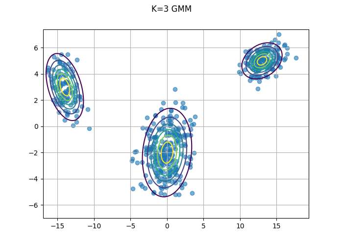
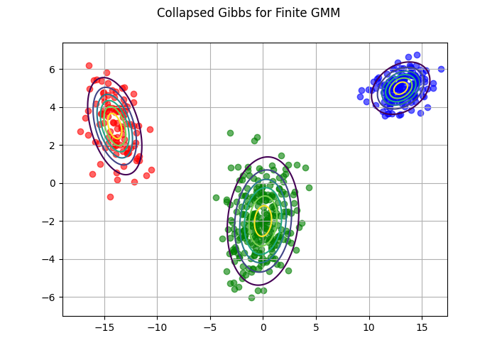
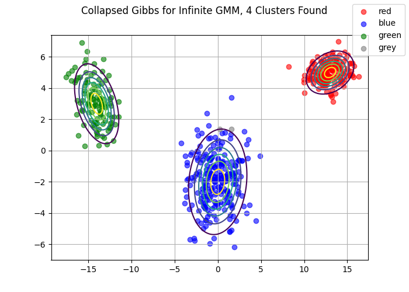

## Introduction

In this post I'm going to discuss collapsed gibbs sampling and how we can apply it to our Gaussian Mixture Model to model an Infinite Gaussian Mixture Model, also known as the Dirichlet Process Gaussian Mixture Model or DPGMM. The name is derived because we place a Dirichlet Process prior on the number of components allowing the number of components to be derived from the data instead of relying on the user to guess the correct number of components. 

# Collapsed Gibbs

Collapsed gibbs sampling is similar to regular gibbs sampling except that we are going to integrate out $\mu$, $\Sigma$, and $\pi$ which allows us to reduce the number of sampling procedures required. It can also be shown that collapsed gibbs sampling will converge more efficiently in the MCMC chain. The reasons for this are beyond the scope of this post, but we might add another post later focusing on this topic. Looking back at our GMM from other posts, we know that we chose $p(\pi|\alpha)$ and $p(\mu,\Sigma| \beta)$ to be conjugate so we are actually able to integrate them out and only sample from $p(z|z_{\neg i},\beta,\alpha)$. Here we're using the notation $z_{\neg i}$ to denote the vector $z$ after removing $z_i$. Kamper (2013) shows that:

$$
\begin{align*}
p(z_i=k|z_{\neg i},\mathcal{D},\beta,\alpha) & \propto p(z_i=k|\alpha)p(x_i|\mathcal{D}_{\neg i},z_i = k,z_{\neg i}\beta)
\end{align*}
$$
We can start by breakup up the right hand side of the statement and by focusing on the first term. Here we only need to integrate out $\pi$ from $p(z_i=k|\alpha)$.

$$
\begin{align*}
p(z_i = k|\alpha) & = \int_{\pi}p(z|\pi)p(\pi|\alpha)d\pi\\
& = \int_{\pi}\prod_{k=1}^K\pi_k^{N_k}\frac{1}{B(\alpha)}\prod_{k=1}^Kx_k^{\alpha_k -1}d\pi\\
& = \frac{1}{B(\alpha)}\int_{\pi}\prod_{k=1}^K\pi_k^{N_k+\alpha_k -1}d\pi\\
\end{align*}
$$
We can recognize that $\pi_k^{N_k+\alpha_k -1}d\pi$ as the un-normalized Dirichlet distribution. Taking advantage of this fact we can show that for any un-normalized probability distribution $D$, $\int D = \frac{1}{C}$ where $C$ is the normalizing constant of the distribution. Therefore,

$$
\begin{align*}
p(z|\alpha) & = \frac{\Gamma(\alpha)}{\Gamma(N+\alpha)}\prod_{k=1}^K\frac{\Gamma\left(N_K + \frac{\alpha}{k}\right)}{\Gamma\left(\frac{\alpha}{k}\right)}
\end{align*}
$$
Now we can work to get this in the form that we want, which is as follows:
$$
\begin{align*}
p(z_i =k | z_{\neg i}, \alpha) & = \frac{p(z_i =k, z_{\neg i} | \alpha)}{p(z_{\neg i}| \alpha)}\\
& = \frac{p(z_i = k | \alpha)}{p(z_{\neg i}| \alpha)}\\
& = \frac{N_{k \neg i} + \frac{\alpha}{k}}{N+\alpha - 1}
\end{align*}
$$
Next we can turn our attention to $p(x_i|\mathcal{D}_{\neg i},z_i = k,z_{\neg i}\beta)$ where $\beta$ represents the parameters to the Normal Inverse Wishart distribution. Using [1, p.843] we get:

$$
\begin{align*}
p(x_i|\mathcal{D}_{k\neg i},z_i = k,z_{\neg i}\beta) & = p(x_i|\mathcal{D}_{k\neg i},\beta)\\
& = \frac{p(x_i,\mathcal{D}_{k\neg i}|\beta)}{p(\mathcal{D}_{k\neg i}|\beta)}\\
& = \frac{p(\mathcal{D}_{k}|\beta)}{p(\mathcal{D}_{k\neg i}|\beta)}
\end{align*}
$$

Which is equivalent to the posterior predictive distribution given by:

$$
\begin{align*}
p(x_i|\mathcal{D}_{k\neg i},z_i = k,z_{\neg i}\beta) & = \mathcal{T}\left(x_i|\mu_o,\frac{\kappa_n+1}{\kappa_n(v_n - D+1)}S_n, v_n - D + 1\right)
\end{align*}
$$
Now that we have everything that we need, we can formally write out the collapsed gibbs algorithm as follows:

<head>
<script src="https://cdnjs.cloudflare.com/ajax/libs/KaTeX/0.11.1/katex.min.js"
        integrity="sha256-F/Xda58SPdcUCr+xhSGz9MA2zQBPb0ASEYKohl8UCHc=" crossorigin="anonymous">
</script>
<link rel="stylesheet" href="https://cdn.jsdelivr.net/npm/pseudocode@latest/build/pseudocode.min.css">
<script src="https://cdn.jsdelivr.net/npm/pseudocode@latest/build/pseudocode.min.js">
</script>
</head>
<pre id="collapsed_gibbs" style="display:hidden;">
    \begin{algorithm}
    \caption{Collapsed Gibbs Sampler for a finite GMM}
    \begin{algorithmic}
    \STATE Choose an initial $\pmb{z}$
        \FOR{$T$ iterations}
          \FOR{$i=1$ to $N$}
            \STATE Remove $x_i$'s  statistics from $z_i$
            \FOR{$k=1$ to $K$}
            \STATE Calculate $p(z_i = k|z_{\neg i},\alpha)$
            \STATE Calculate $p(x_i|\mathcal{D}_{k\neg i},z_i = k,z_{\neg i}\beta)$
            \STATE Calculate $p(z_i = k |z_{\neg i},\mathcal{D},\alpha,\beta) \propto p(z_i = k|z_{\neg i},\alpha)p(x_i|\mathcal{D}_{k\neg i},z_i = k,z_{\neg i}\beta)$
            \ENDFOR
            \STATE Sample $k_{new}$ from $p(z_i = k |z_{\neg i},\mathcal{D},\alpha,\beta)$ after normalizing
            \STATE Add $x_i$'s statistic to the component $z_i = k_{new}$
          \ENDFOR
        \ENDFOR
    \end{algorithmic}
    \end{algorithm}
</pre>
<script>
    pseudocode.renderElement(document.getElementById("collapsed_gibbs"));
</script>

Now let's use the same data as from prior posts and solve the finite GMM case when $k=3$.

```{python,}
import numpy as np
from numpy.random import multinomial
from scipy.stats import dirichlet, multivariate_t, multivariate_normal
import matplotlib.pyplot as plt
from matplotlib.lines import Line2D
import pandas as pd

# Define parameters for K=3 Mixture of Multivariate Gaussians
phi = [.3, .5, .2]
mu = np.array([[13,5], [0,-2], [-14,3]])
cov_1 = np.array([[2.0, 0.3], [0.3, 0.5]])
cov_2 = np.array([[3.0,.4], [.4,3.0]])    
cov_3 = np.array([[1.7,-.7], [-.7,1.7]])
cov = np.stack((cov_1, cov_2, cov_3), axis = 0)

def data_gen(mu, cov, phi, n):
    """
    Generates samples from Mixture of K Multivariate Gaussian Distributions
    """
    y = np.empty((n, 2))
    z = []
    for i in range(n):
        ind = multinomial(1, phi)
        for j, val in enumerate(ind):
            if val == 1:
                z.append(j)
                y[i,:] = np.random.multivariate_normal(mu[j,:], cov[j,:,:])
            else:
                next
    return np.array(y), z
  
data, z = data_gen(mu, cov, phi, 500)
x, y = np.mgrid[-17:17.5:.1, -7:7.5:.1]
pos = np.dstack((x,y))

fig, ax = plt.subplots()
ax.scatter(data[:,0], data[:,1], alpha = .6);
for i in range(3):
    ax.contour(x,y, multivariate_normal(mu[i,:], cov[i,:,:]).pdf(pos), extend='both');


fig.suptitle("K=3 GMM")
ax.grid()
fig.savefig("data_plot.png")
plt.close(fig)
```

```{r, echo=FALSE, fig.align='center', out.height="75%", out.width="75%"}

```

And now we create our code for the collapsed gibbs sampler and fit it to our data.

```{python}

def collapsed_gibbs(data, a, v, K, iters = 500):
    N = data.shape[0]
    D = data.shape[1]
    assert v > D-1, "v must be greater than D-1"
    alpha = np.repeat(a, K)
    z = np.random.choice(K, size = N, replace = True, p =dirichlet(alpha / K).rvs().squeeze())
    for _ in range(iters):
        for i in range(N):
            # Remove x_i from data and Z
            d2 = np.delete(data, i, axis=0)
            z2 = np.delete(z, i, axis=0)
            p_z = []
            for k in range(K):
                mu_k = np.mean(d2[z2 == k], axis=0)
                # cov_k = np.cov(d2[z2 == k], rowvar=False)
                n_k = np.sum(z2 == k)
                p_z_k = (n_k + a/K) / (N + a - 1)
                S_k = np.dot(np.transpose(d2[z2 == k] - mu_k), d2[z2 == k] - mu_k) + np.eye(D)
                p_x_i = multivariate_t(mu_k, ((n_k+1) / (n_k *(n_k + v - D + 1)))*S_k, n_k+v - D + 1).pdf(data[i,])
                p_z_k = p_z_k * p_x_i
                p_z.append(p_z_k)
            # Standardize prob vector p(z_i = k)
            p_z = p_z / np.sum(p_z)
            z[i] = np.random.choice(K, 1, replace=True, p = p_z)

    return z

z_pred = collapsed_gibbs(data, 5, 2, K=3, iters=20)

fig, ax = plt.subplots()
cols = ["red", "blue", "green"]
for i, v in enumerate(cols):
    d2 = data[np.array(z_pred) == i,:]
    ax.scatter(d2[:,0], d2[:,1], color=v, alpha = .6);
    ax.contour(x,y, multivariate_normal(mu[i,:], cov[i,:,:]).pdf(pos), extend='both');


fig.suptitle("Collapsed Gibbs for Finite GMM")
ax.grid()
fig.savefig("collapsed_gibbs.png")
plt.close(fig)
```

```{r, echo=FALSE, fig.align='center', out.height="75%", out.width="75%"}

```

## Extending to the Infinite GMM

Extending our existing model to the case with infinite clusters is rather straight forward from here. In my last post I discuss the Dirichlet Process and how you can model an infinite probability vector using the Chinese Restaurant Process.

Earlier we showed that,

$$
\begin{align*}
p(z_i =k | z_{\neg i}, \alpha) & = \frac{N_{k \neg i} + \frac{\alpha}{k}}{N+\alpha - 1}
\end{align*}
$$
In the case of infinite $K$ we end up with a CRP where:

$$
\begin{align*}
p(z_i =k | z_{\neg i}, \alpha) & = \left\{
\begin{array}{ll}
      \frac{N_{k \neg i}}{N+\alpha - 1}  & \text{if}\;\;\; N_k > 0\\
      \frac{\alpha}{N+\alpha - 1}  & \text{Otherwise}\\
\end{array} 
\right. \\
\end{align*}
$$
Everything else is the same as the finite GMM giving the following Algorithm,

<pre id="collapsed_gibbs_igmm" style="display:hidden;">
    \begin{algorithm}
    \caption{Collapsed Gibbs Sampler for an Infinite GMM}
    \begin{algorithmic}
    \STATE Choose an initial $\pmb{z}$
        \FOR{$T$ iterations}
          \FOR{$i=1$ to $N$}
            \STATE Remove $x_i$'s  statistics from $z_i$
            \FOR{$k=1$ to $K$}
              \STATE Calculate $p(z_i = k|z_{\neg i},\alpha)$
              \STATE Calculate $p(x_i|\mathcal{D}_{k\neg i},z_i = k,z_{\neg i}\beta)$
              \STATE Calculate $p(z_i = k |z_{\neg i},\mathcal{D},\alpha,\beta) \propto p(z_i = k|z_{\neg i},\alpha)p(x_i|\mathcal{D}_{k\neg i},z_i = k,z_{\neg i}\beta)$
            \ENDFOR
            \STATE Calculate $p(z_i =k^* | z_{\neg i}, \alpha) = \frac{\alpha}{N+\alpha - 1}$
            \STATE Calculate $p(x_i|\beta)$ Under the Prior
            \STATE Calculate $p(z_i = k^* |z_{\neg i},\mathcal{D},\alpha,\beta) \propto p(z_i =k^* | z_{\neg i}, \alpha)p(x_i|\beta)$
            \STATE Sample $k_{new}$ from $p(z_i = k |z_{\neg i},\mathcal{D},\alpha,\beta)$ after normalizing
            \STATE Add $x_i$'s statistic to the component $z_i = k_{new}$
            \STATE If any component is empty, remove it and decrease $K$
          \ENDFOR
        \ENDFOR
    \end{algorithmic}
    \end{algorithm}
</pre>
<script>
    pseudocode.renderElement(document.getElementById("collapsed_gibbs_igmm"));
</script>

Now we can create the code for our Infinite GMM Gibbs Sampler.

```{python}
def collapsed_gibbs_IGMM(data, a, v, K, iters = 500):
    N = data.shape[0]
    D = data.shape[1]
    assert v > D-1, "v must be greater than D-1"
    alpha = np.repeat(a, K)
    z = np.random.choice(K, size = N, replace = True, p =dirichlet(alpha / K).rvs().squeeze())
    df = pd.DataFrame({"k": z, "p_z": np.nan})
    g_not = []
    for q in range(iters):
        for i in range(N):
            groups = list(np.unique(z))
            # Remove x_i from data and Z
            d2 = np.delete(data, i, axis=0)
            z2 = np.delete(z, i, axis=0)
            p_z = []
            g = []
            for k in groups:
                if np.sum([z2 == k]) == 0:
                    g_not.append(k)
                    # This is the last group so just move on
                    continue
                
                mu_k = np.mean(d2[z2 == k], axis=0)
                # cov_k = np.cov(d2[z2 == k], rowvar=False)
                n_k = np.sum(z2 == k)
                p_z_k = (n_k + a/K) / (N + a - 1)
                S_k = np.dot(np.transpose(d2[z2 == k] - mu_k), d2[z2 == k] - mu_k) + np.eye(D)
                p_x_i = multivariate_t(mu_k, ((n_k+1) / (n_k *(n_k + v - D + 1)))*S_k, n_k+v - D + 1).pdf(data[i,])
                p_z_k = p_z_k * p_x_i
                g.append(k)
                p_z.append(p_z_k)
            
            # Now consider new component
            p_z_k = (a / len(groups)) / (N + (a/len(groups)) - 1)
            p_x_i = multivariate_t([0 ,0], np.eye(D), v - D + 1).pdf(data[i,])
            p_z_k = p_z_k * p_x_i
            g.append(k+1)
            p_z.append(p_z_k)
            # Standardize prob vector p(z_i = k)
            p_z = p_z / np.sum(p_z)
            z[i] = np.random.choice(g, 1, replace=True, p = p_z)
        df = pd.DataFrame({
            'z': z,
        }).groupby(['z']).size().reset_index(name='counts')
        # Rename clusters to reindex to zero
        # z and z_new are the same thing, but z_new has cluster names from 0 - K
        # where z has cluster names > K. This can be a problem when using the cluster
        # name to subset a list of colors (which is why we rename them)
        lookup = df.to_dict()['z']
        lookup = dict((v,k) for k, v in lookup.items()) 
        z_new = np.array([lookup.get(i) for i in z])
    return z, df, z_new

z_pred, df, z_new = collapsed_gibbs_IGMM(data, 1, 10, K=5, iters=50)

fig, ax = plt.subplots()
# Given that we expect 3 clusters, we assume we won't need more than 6 colors
cols = ["red", "blue", "green", "grey", "yellow", "black"]
# Filter down to required colors. 
cols1 = [cols[i] for i, v in enumerate(np.unique(z_new))]
print(cols)
for i, v in enumerate(cols1):
    d2 = data[np.array(z_new) == i,:]
    ax.scatter(d2[:,0], d2[:,1], color=v, alpha = .6, label = v)
    if i in range(3):
        ax.contour(x,y, multivariate_normal(mu[i,:], cov[i,:,:]).pdf(pos), extend='both')


fig.suptitle(f"Collapsed Gibbs for Infinite GMM, {df.shape[0]} Clusters Found")
ax.grid()
fig.legend()
fig.savefig("collapsed_gibbs_igmm.png")
plt.close(fig)
```

```{r, echo=FALSE, fig.align='center', out.height="75%", out.width="75%"}

```

Note that we do have a few extra clusters here, but for the most part our output looks pretty good. With our gibbs sampler, we will continue to add and remove clusters but we've clearly converged to approximately 3 total clusters. 